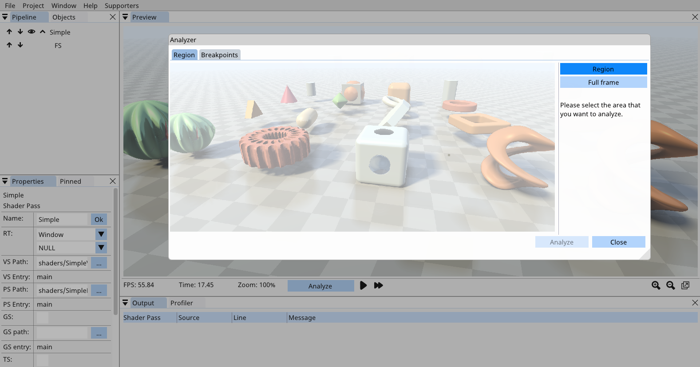
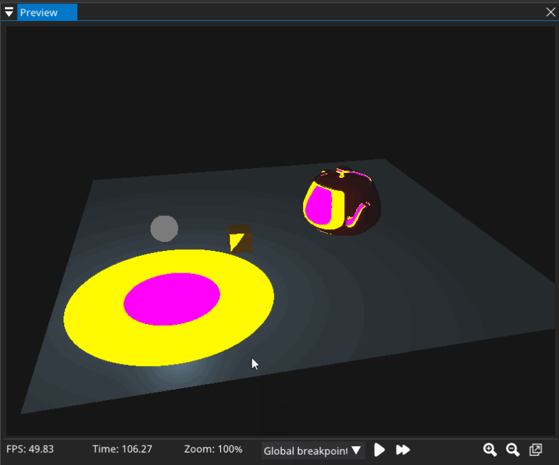

.. include:: <isonum.txt>

Frame Analysis
==========================================
SHADERed comes with a tool that lets you analyze your shaders more in-depth.

This tool comes with a set of features that will be described in the next few sections.
Before we jump into describing those features, we should first see how to initiate the frame analysis.

First, pause the preview by pressing the pause button on Preview window's statusbar (the statusbar might be not be enabled by default, to enable it, turn on the `Options` |rarr| `Preview` |rarr| `Statusbar` option)
or by hitting the `Space` key.

Once the preview is paused, you will see the `"Analyze"` button on the previously mentioned statusbar. Click on that button and a window will open up.

This window contains two tabs - `Region` and `Breakpoints`. The `Breakpoints` tab will be covered in the `Global breakpoints`_ section and we will now only focus on the `Region` tab.
Here you can choose whether you want to analyze the whole frame (render it with the software renderer) or just a small region.
I definitely recommend running the analyzer on a smaller region if you have some very complex shader.
Running it on the whole frame, each pixel having (for example) 60k instructions, will take quite some time.

You select a region by left clicking and then dragging. Once you are done, hit the `Analyze` button.

SHADERed will now gather various data about your shader. You can switch between various view using the dropdown in the statusbar.

Detect undefined behavior
******************************************
When analyzing a frame, SHADERed will on each pixel analyzed check if any of the undefined behaviors occured.

Pixels with undefined behavior will be colored with bright white color.
Hovering over them will display the cause of the undefined behavior, exact line on which the undefined behavior happened and how many undefined behaviors happened on that pixel.
Note that if you have multiple undefined behaviors on one pixel, only the last reason will be displayed.
You can click on the pixel and start the debugger through the `Pixel Inspect` window.

Here's a list of all undefined behaviors SHADERed can detect:

 * division by zero
 * mod by zero
 * asin(x) when abs(x) > 1
 * acos(x) when abs(x) > 1
 * acosh(x) when abs(x) >= 1
 * atanh(x) when abs(x) >= 1
 * atan2(y, x) when x = y = 0
 * pow(x, y) when x < 0 or when when x = 0 and y <= 0
 * log(x) when x <= 0
 * log2(x) when x <= 0
 * sqrt(x) when x < 0
 * inversesqrt(x) when x <= 0
 * min(x, y) when x or y is NaN
 * max(x, y) when x or y is NaN
 * clamp(x, minVal, maxVal) when minVal > maxVal
 * smoothstep(edge0, edge1, x) when edge0 >= edge1
 * frexp(x, out exp) when x is NaN or inf
 * ldexp(x, exp) when exp > 128 (float) or exp > 1024 (double)

.. image:: images/UndefinedBehavior.png
   :alt: Undefined behavior viewer

Global breakpoints
******************************************
In the previously mentioned `Breakpoints` tab, you will see breakpoints that you've placed in "relevant" shaders (the ones that will be executed by the software renderer).
You can select up to 8 breakpoints. For each breakpoint you can change the color.
This color will be shown instead of the original pixel color in the preview window if SHADERed hit the breakpoint (note that you must change the view with the dropdown located on the statusbar).

The breakpoints don't have to be conditional breakpoints, but if they are, the pixels will only be colored with the breakpoint color if the condition has been met.

Heatmap
******************************************
After switching to "Heatmap" view, you will be able to see how many *SPIR-V instructions* were executed for each pixel.
Note that this is not a true representation of actual instruction count executed on the GPU.

.. image:: images/Heatmap.png
   :alt: Heatmap

Variable value viewer
******************************************
To see the variable's value on a certain line, open the text editor, hold CTRL + ALT and left click on the variable whose value you want to see.

You don't have to analyze the whole frame to see variable's value throughout the whole frame.

.. image:: images/VariableValueViewer.png
   :alt: Variable value

Miscellaneous
******************************************
After done with analyzing the frame, this feature set includes another window "Frame analysis".
In this window you can see miscellaneous information about your shader and frame.

There's color histogram. You can switch between RGB, R, G and B views.
Color histogram takes the data from the GPU renderer, so you don't need to analyze the whole frame.

This window will also contain various stats, such as: average instruction count, number of pixels rendered, number of pixels discarded, etc...

There's also pixel history section which will allow you to debug pixel's that were rendered over and are now invisible.

.. image:: images/FrameAnalysis.png
   :alt: Frame Analysis window
