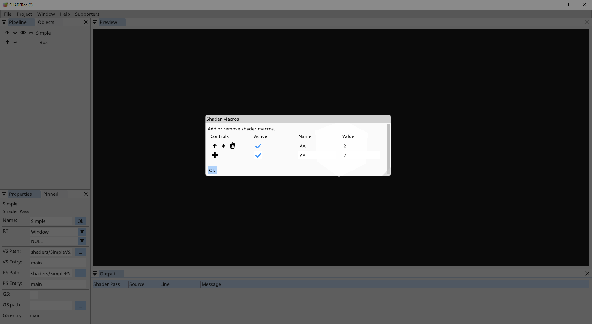

.. include:: <isonum.txt>

Shader Pass
==========================================
Shader Pass is a pipeline item which tells SHADERed what items to render and what shader to use.
SHADERed will ask you to enter the path to your shaders when you are creating a shader pass item.
Shader files will be automatically created if you do not provide your own.
You must set shader entry for HLSL shaders. Shader entry is the "main" function of your shader.
Check the "GS used" checkbox if you want to use geometry shaders.
You can later change all of this in the properties.

Child items
******************************************
To add items to a shader pass, right click on the shader pass |rarr| Add |rarr| pick item type. Here's a list of item types that you can add to the shader pass:

Geometry
~~~~~~~~~~~~~~~~~~~~~~~~~~~~~~~~~~~~~~~~~~
Geometry item is just a basic built-in 3D geometry. Here's a list of geometry types that you can use:

 * Cube
 * ScreenQuad
 * Circle
 * Triangle
 * Sphere
 * Plane
 * ScreenQuadNDC |rarr| the difference between ScreenQuadNDC and ScreenQuad is that ScreenQuadNDC is using normalized device coordinates [-1, 1] which means that you don't have to process its position in vertex shader, meanwhile you have to multiply ScreenQuad's vertex positions (usually with Orthographic matrix) in order to display something reasonable

Each geometry item has these properties:
 * Position
 * Scale
 * Rotation
 * Topology |rarr| triangles, triangle strip, lines, etc...
 * Instanced |rarr| is this item instanced?
 * Instance count |rarr| number of instances
 * Instance buffer |rarr| the buffer that will supply positions, normals, etc... for each instance

3D Model
~~~~~~~~~~~~~~~~~~~~~~~~~~~~~~~~~~~~~~~~~~
You can load 3D models if you require objects more complex than the simple built-in geometry. SHADERed uses `assimp <https://www.assimp.org/>`_ which means that all the formats that assimp supports will be supported by SHADERed too.

3D models have the same properties as the geometry items.

Vertex Buffer
~~~~~~~~~~~~~~~~~~~~~~~~~~~~~~~~~~~~~~~~~~
Vertex buffers are pipeline items whose vertices are supplied from a buffer object.

Vertex buffers have the same properties as the geometry items & 3D models.

Render State
~~~~~~~~~~~~~~~~~~~~~~~~~~~~~~~~~~~~~~~~~~
Render states allow you to use, modify & turn on/off: depth testing, blend states, stencil tests, etc...

Render state is only applied to items below it and the internal state is reset with every shader pass.

Variables
******************************************
Right click on the shader pass |rarr| `Variables` to access the variable manager.
Here you'll see list of all of your variables for this shader pass.
You can add, delete & modify variables.
The names of variables in this window must match the names of variables in the shader's code (doesn't matter what language you are using).
Some variables will also have these flags available: "use last frame value" & "invert".
If "use last frame value" is checked, the value of this variable will lag 1 frame.
This is useful for example when you want to get the speed of the camera.
"Invert" flag will create inverse of a matrix

System variables are variables whose value SHADERed will automatically generate.

You can pin variables to the Pinned window by pressing the "+" button. Unpin them by pressing the "-" button.

.. image:: images/VariableManager.png
   :alt: Variable manager

Change variable value for pipeline items
~~~~~~~~~~~~~~~~~~~~~~~~~~~~~~~~~~~~~~~~~~
You can change variable value only for a specific pipeline item. For example, this is useful
when you have two cubes rendered with the same shader pass but want them to have different colors or materials.
Right click on a cube #2 |rarr| `Change variables` |rarr| pick the variable that you want to change
and enter its new value. The variable will now take that value only when rendering cube #2.

System variables
~~~~~~~~~~~~~~~~~~~~~~~~~~~~~~~~~~~~~~~~~~
As mentioned previously, system variables are variables whose value SHADERed will generate.
Here's a list of all system variables and the value they hold:

 * Time (`float`) |rarr| elapsed time
 * TimeDelta (`float`) |rarr| elapsed time between this and previous frame
 * FrameIndex (`int`) |rarr| frame index
 * ViewportSize (`float2/vec2`) |rarr| current viewport size in pixels
 * MousePosition (`float2/vec2`) |rarr| position of the mouse in [0, 1]
 * View (`float4x4/mat4`) |rarr| camera's view matrix
 * Projection (`float4x4/mat4`) |rarr| perspective projection matrix
 * ViewProjection (`float4x4/mat4`) |rarr| View * Projection
 * Orthographic (`float4x4/mat4`) |rarr| orthographic projection matrix
 * ViewOrthographic (`float4x4/mat4`) |rarr| View * Orthographic
 * GeometryTransform (`float4x4/mat4`) |rarr| pipeline item's transform matrix (if you want to apply translation, rotation & scaling)
 * IsPicked (`bool/int`) |rarr| is this item selected by the user with the left click?
 * IsSavingToFile (`bool/int`) |rarr| are we currently rendering to an image file?
 * CameraPosition (`float4/vec4`) |rarr| the position of our camera
 * CameraPosition3 (`float3/vec3`) |rarr| the position of our camera
 * CameraDirection3 (`float4/vec4`) |rarr| the direction at which the camera is looking
 * KeysWASD (`bool4/bvec4`) |rarr| are (W,A,S,D) keys down?
 * Mouse (`float4/vec4`) |rarr| (mouse position x, mouse position y, is left mouse button down, is right mouse button down)
 * MouseButton (`float4/vec4`) |rarr| (current mouse position x, current mouse position y, last position when the left button was down x, last position when the left button was down y)

Function values
~~~~~~~~~~~~~~~~~~~~~~~~~~~~~~~~~~~~~~~~~~
Functions are a way to store 'programmatically calculated' values in the variable. Here's a list of functions:

 * Pointer |rarr| a pointer to some other variable - this will copy the value of the chosen variable
 * CameraSnapshot |rarr| get one of the camera's matrix
 * ObjectProperty |rarr| get 3D objects property in a variable (position, rotation, scale)
 * MatrixIdentity |rarr| creates an identity matrix
 * MatrixLookAtLH |rarr| create a 'look at'-view matrix
 * MatrixLookToLH |rarr| create a 'look to'-view matrix
 * MatrixOrthographicLH |rarr| create a projection matrix
 * MatrixPerspectiveFovLH |rarr| create a projection using FOV matrix
 * MatrixPerspectiveLH |rarr| create a projection matrix
 * MatrixRotationAxis |rarr| rotation matrix around an axis
 * MatrixRotationNormal |rarr| rotation around a normal 
 * MatrixRotationRollPitchYaw |rarr| roll, pitch & yaw rotation
 * MatrixRotationX |rarr| rotation around X axis
 * MatrixRotationY |rarr| rotation around Y axis
 * MatrixRotationZ |rarr| rotation around Z axis
 * MatrixScaling |rarr| create a scale matrix
 * MatrixTranslation |rarr| create a translation matrix
 * ScalarCos |rarr| calculate cos
 * ScalarSin |rarr| calculate sin
 * VectorNormalize |rarr| normalize(vector)

Input layout
******************************************
In the input layout manager you decide what to send to vertex shader's input.
Here's a list of currently available options:

 * Position (`float3/vec3`)
 * Normal (`float3/vec3`)
 * Texture coordinate (`float2/vec2`)
 * Tangent (`float3/vec3`)
 * Binormal (`float3/vec3`)
 * Color (`float4/vec4`)

Macros
******************************************
You can define preprocessor macros through the UI. Right click on a shader pass |rarr| click `Macros`.

The VALUE field is optional. When the `active` checkbox is unchecked it temporarily *undefines* the macro.

Basically this adds preprocessor macros to your shader in this format:

#define NAME VALUE

Adding/removing/(de)activating a macro requires shaders to be recompiled.

Resources
******************************************
In the resources window you can see all the objects that are bound
to this shader pass and you can change the slots to which those objects are bound to.

.. image:: images/Resources.png
   :alt: Resources
