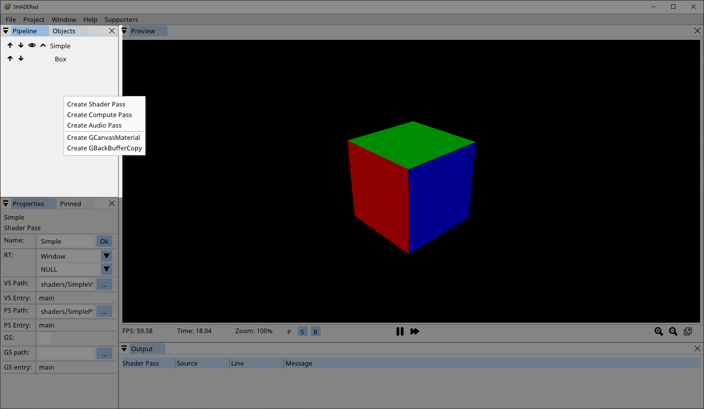
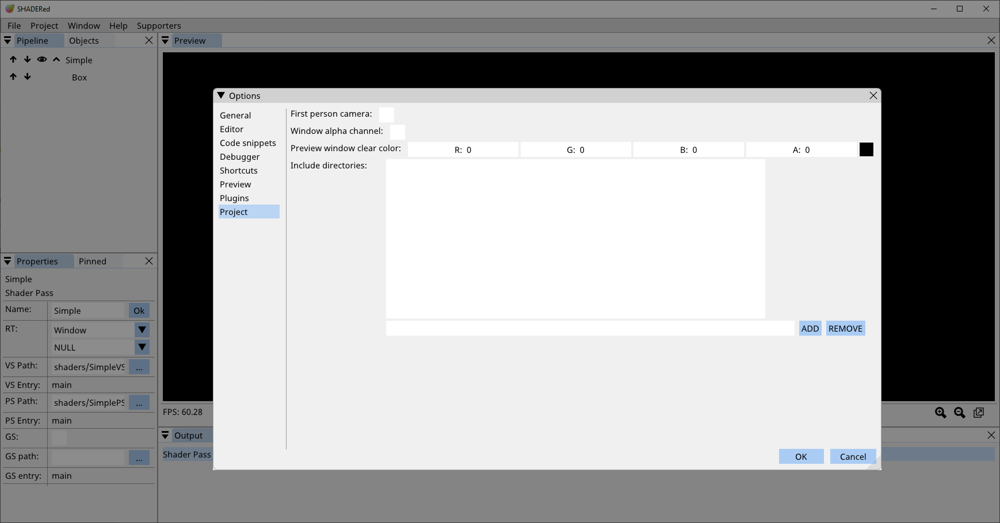
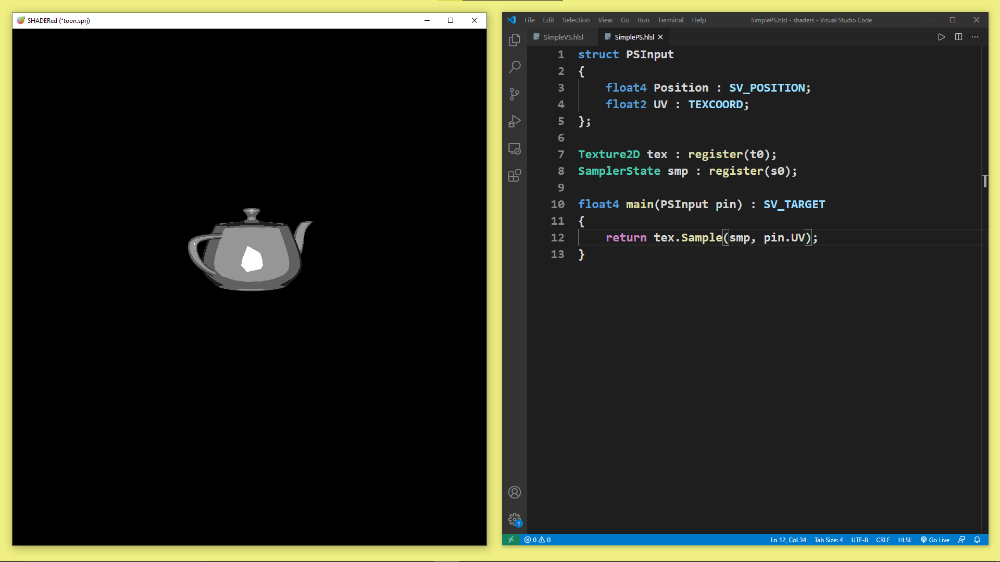
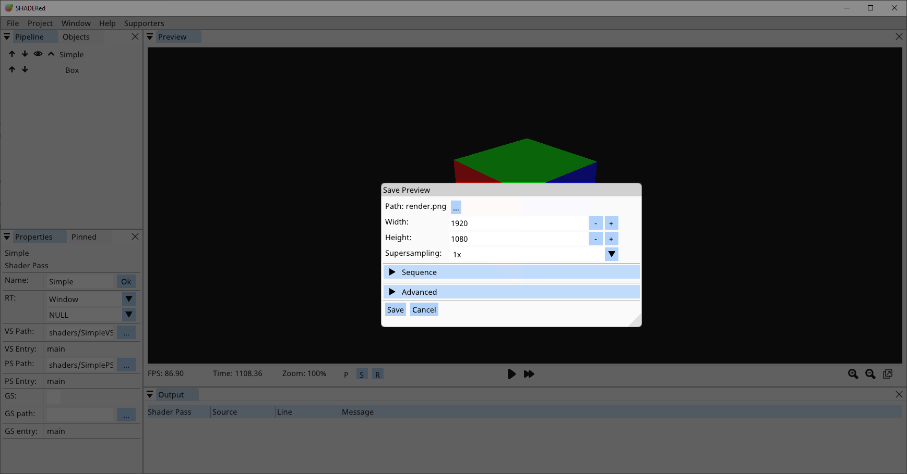

.. include:: <isonum.txt>

Workspace
==========================================
SHADERed's workspace is very modular. You can hide & organize the
windows however you want to. The workspace layout will be saved to
a file as soon as you make changes and it will be loaded on the next startup.

The workspace consists of several windows. We will briefly describe every window
in the next section.

Windows
******************************************
Preview
~~~~~~~~~~~~~~~~~~~~~~~~~~~~~~~~~~~~~~~~~~
Preview window contains the output of your shaders. The default camera is
the "arcball camera". You can rotate around the origin with right mouse click,
increase/decrease the distance from origin with scroll wheel. The camera will
always look at the origin point. You can change the camera to "first person camera"
by checking the `Options` |rarr| `Project` |rarr| `First person camera` checkbox.
Use WASD keys to move the first person camera around and right mouse button to look around.

You can pick 3D objects by pressing the left mouse button while hovering over a 3D object.
You can pick multiple 3D objects by holding *SHIFT* key and pressing the left mouse button.
Press SHIFT+D (can be changed in options) to duplicate picked items. A gizmo/manipulator
& a bounding box will appear once you pick 3D objects. You can easily set up your 3D scene
by using the gizmo/manipulator to move/scale/rotate the objects. The *P*, *S* &
*R* buttons in the status bar can be used to switch what action the manipulators will perform.

 * *P* button (position) |rarr| the manipulator will move the object
 * *S* button (scale) |rarr| the manipulator will scale the object
 * *R* button (rotation) |rarr| the manipulator will rotate the object.

.. image:: images/PreviewWindow.png
   :alt: Preview window

Status bar might be hidden by default but you can show it either with the `Preview.ToggleStatusBar`
shortcut or by checking the `Options` |rarr| `Preview` |rarr| `Status bar` checkbox.
The status bar contains information such as FPS (frames per second), elapsed time, current zoom
factor & which 3D objects are picked.
The pause button will stop the time while the fast forward button will increase the time by 0.1s.
To zoom in on an area, hold the `ALT` key and select the area in the preview window with left mouse button.

Pipeline
~~~~~~~~~~~~~~~~~~~~~~~~~~~~~~~~~~~~~~~~~~
Pipeline window is probably the most important part of the workspace. You can compare it to game's
main loop. In this window you tell SHADERed how and what to render.

Double clicking on an item usually does something. For example, double clicking on a shader pass item 
will open shaders in the code editor. It will also open the item in the Properties_. window.
The up/down arrow buttons will move the item up/down in the pipeline. You can hide shader pass' children by pressing the collapse button.
The eye icon button can be used to disable the item. Item won't be processed
by the renderer if it's disabled.
Right clicking on this window will open a context menu that shows items which can be created.

You can move items from one shader pass to another by drag and dropping them. Hold CTRL key to duplicate the item while dragging it.

Right clicking on a pipeline item will open a context menu with lots of options. Some of these options for shader pass are described `here <shaderpass.html>`_.

If two shader passes draw to the same render texture and are located next to each other (one shader pass
is immediately below the other), the render texture they are rendering to won't be cleared when executing the second shader pass which means
that you can use two separate shader passes to draw to a single render texture. The render texture will
be cleared in all other situations.

Read more about shader passes `here <shaderpass.html>`_

Objects
~~~~~~~~~~~~~~~~~~~~~~~~~~~~~~~~~~~~~~~~~~
The "Objects" window contains the list of all of your textures, buffers, 2D/3D images, audio files, cubemaps, render textures, etc...

Just like in the Pipeline window, right click on the window opens a context menu with objects you can create, right click on an object opens additional menu with various options &
if the preview is available for this this object then double clicking on it will open the preview in a special window.  

.. image:: images/ObjectsWindow.png
   :alt: Objects window

Properties
~~~~~~~~~~~~~~~~~~~~~~~~~~~~~~~~~~~~~~~~~~
Right click on an item/object |rarr| `Properties` (or double click on the item/object) to open it in the Properties window.
In this window you can change all the important information such as
shader & texture paths, object position, rotation & scale, etc...

.. image:: images/PropertiesWindow.png
   :alt: Objects window

Pinned
~~~~~~~~~~~~~~~~~~~~~~~~~~~~~~~~~~~~~~~~~~
In this window you can find all your pinned uniform variables. We described how to pin variables in `Shader Pass <shaderpass.html>`_ section.

This window makes accessing and modifying your variables easier.

.. image:: images/PinnedWindow.png
   :alt: Pinned window

Output
~~~~~~~~~~~~~~~~~~~~~~~~~~~~~~~~~~~~~~~~~~
Output window contains a list of messages (usually) generated by the compiler.

The table consists of 4 columns:

 * Shader Pass |rarr| the name of the shader pass that produced this message
 * Source |rarr| the shader stage that produced this message

  * PS |rarr| pixel shader
  * VS |rarr| vertex shader
  * GS |rarr| geometry shader
  * CS |rarr| compute shader
  * AS |rarr| audio shader

 * Line |rarr| the line that caused this message to be generated
 * Message |rarr| the contents of the message. Error messages will usually use red color. 

You can click on the message if it contains line and source and it'll open appropriate
text editor.

.. image:: images/OutputWindow.png
   :alt: Output window

Pixel Inspect
~~~~~~~~~~~~~~~~~~~~~~~~~~~~~~~~~~~~~~~~~~
Left click on a pixel in the preview window to fetch pixel's color when the preview is paused.
The information will be displayed in this window. You can also start the shader debugger through this window.

Other debugger related windows will be described in the `Debugger <debugger.html>`_ section.

You can switch between windows using CTRL + Tab shortcut. You can hide UI by going into the "Performance mode" (by pressing `F` key or `Window` |rarr| `Performance Mode`)

.. image:: images/PixelInspectWindow.png
   :alt: Pixel inspect window

Project options
******************************************
You can modify project's settings by going to `Project` |rarr| `Options`. Here's what you can change:

 * *First person camera* |rarr| switch from arcball camera to first person camera
 * *Window alpha channel* |rarr| when active, the format of Preview window's main render texture will be RGBA instead of RGB
 * *Preview window clear color* |rarr| the color which will be used to clear the window. The alpha channel is ignored if *Window alpha channel* is not ticked.
 * *Include directories* |rarr| add directories which will be looked up when you use #includes in your shaders

Templates
******************************************
Templates are a great way to avoid repetitive tasks when building a SHADERed project. For example, when you work a lot with
shaders that utilize the G-Buffer, you could just set up the template rather than having to write same shaders every time.

To create your own templates, first open the *templates* directory located in SHADERed's installation directory.
Place a folder containing *template.sprj* file in the *templates* directory. The folder's name will be used in the `File` |rarr| `New` menu.

Once you open the template through the `File` |rarr| `New` menu, you can't directly modify it. You have to save a copy of it somewhere. SHADERed will open the "Save As" dialog for you the first time you try to save.

Using an external text editor
******************************************
You can use a text editor of your choice if you don't like the built-in one.
There are quite a few settings in options that make this experience seamless. Open "Options" and turn on the "Recompile shader on file change" and
"Open shaders in an external editor" options.

Now when you double click on shader pass SHADERed will open the shader pass' files in an external editor rather than the built-in one.
Once you make changes to the file through your favorite text editor and hit CTRL+S (you modify the file), SHADERed will automatically detect these changes and recompile shaders.

Render to image file
******************************************
Do you want to save your output to an image file? Click `Project` |rarr| `Render` in the menubar.
In this window you are able to change various options. You can change output's path, width, height & level of supersampling used.
In the "Advanced" section you can change values of various system variables:

 * *Time* |rarr| current time
 * *Time delta* |rarr| time that was needed between previous and current frame
 * *Frame index* |rarr| index of the current frame
 * *WASD* |rarr| set whether W, A, S or D key is down
 * *Mouse* |rarr| set relative mouse position (0.0 - 1.0) and set left & right mouse button state

In the "Sequence" you can choose to render to a sequence of images. Check the "Record" checkbox and decide how long you want your sequence to be & how many frames per seconds do you want to have it.
When you are rendering to a image sequence you can use C-like %d format specifier in the filename to specify how
and where you want your frame index to be kept. SHADERed will automatically append %d at the end of your filename if you don't put the %d in filename by yourself.
You can then use a tool such as `ffmpeg` to combine these images into a video, GIF, etc...

Camera snapshots
==========================================
This feature lets you achieve effects such as shadow mapping.
With this feature you can emulate having multiple cameras. Go to
`Project` (in the menu bar) |rarr| `Camera snapashots` and there you will be able to either add a new snapshot
or delete existing ones. SHADERed will copy camera's current view matrix when you
press "Add" and store that matrix under a name that you specify.

To use these matrices, define a float4x4/mat4 variable in the VariableManager and use
the `CameraSnapshot <shaderpass.html#function-values>`_ function.

Code snippets
==========================================
Code snippets make it easier to write reapeating code patterns. These snippets will be listed in autocomplete. You can add code snippets in `Options`.
To define a placeholder use {$NUMBER}. The numbers start from 1. To assign a default string to a placholder do: {$NUMBER:STRING}. You must assign string first time the placeholder is defined.   

You can pick the language to which this snippet applies:

 * \* |rarr| all languages
 * HLSL |rarr| the snippet will be suggested only in HLSL shaders
 * GLSL |rarr| the snippet will be suggested only in GLSL shaders

The value you enter in the "Display" textbox is the text that will appear in the autocomplete. The snippet will appear in autocomplete once you start typing the words in text editor that you've entered in the "Search" textbox.

.. image:: images/CodeSnippets.png
   :alt: Snippet editor

Browse online
******************************************
"Browse online" window is a new feature introduced in v1.4. You can access it by clicking the `File` |rarr| `Browse online` option.
A window will open and there you can:
 
 * browse & download shaders that are hosted on shadered.org
 * install plugins that are hosted on shadered.org
 * install themes that are hosted on shadered.org

You can search by entering your search query into the "Query: " textbox.
If you want to search for shaders/plugins/themes by a specific user, enter their username into the "By: " textbox.

Use "<<" and ">>" button to go to the previous/next page.

.. image:: images/BrowseOnline.png
   :alt: Browse shaders

Export as C++ project
******************************************
You can generate standalone C++ application from your SHADERed project. Go `File` |rarr| `Export` |rarr| `C++ project`. Most
of the options are self-explanatory. If "Store shaders in memory" option is checked SHADERed will store all the shader code as strings in the output .cpp file, otherwise
it will create a file for each shader.

You can modify the template for C++ output by editing the files in `data/export/cpp` directory (which is located in SHADERed's installation directory). 

.. image:: images/ExportAsCPP.png
   :alt: Export as C++ project
